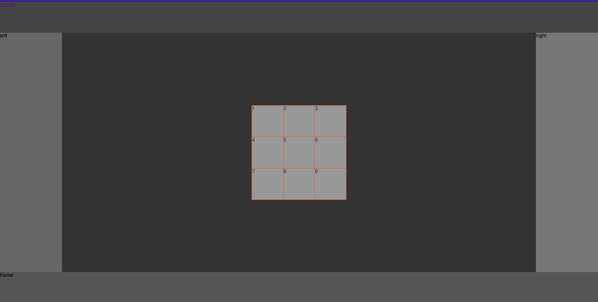

```
echo "# vue3-demo" >> README.md
git init
git add README.md
git commit -m "first commit"
git branch -M main
git remote add origin git@github.com:Picsong/vue3-demo.git
git push -u origin main
```
地图

grid自适应布局

